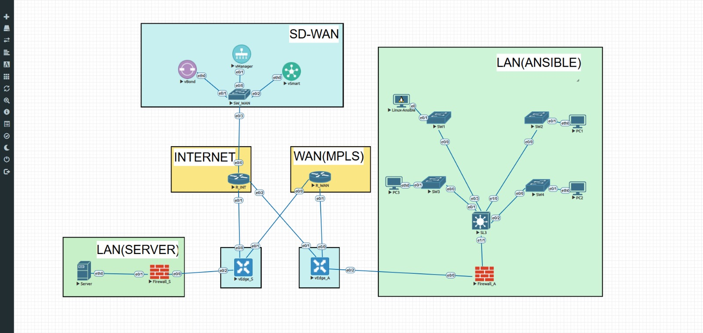

# Automação de Configuração de Switches via Ansible (Telnet)

Este projeto faz parte de um estudo sobre ferramentas open source para automação de configurações e gerenciamento de equipamentos de rede.  
O objetivo é aplicar Ansible em ambientes de rede operacionais para otimizar a configuração e a administração de ativos de rede.  

Além disso, o projeto se conecta com iniciativas relacionadas a SD-WAN, buscando aprimorar a eficiência e a segurança da infraestrutura de TI.

---

## Visão Geral

- Utiliza Ansible com `connection: local` e comandos enviados via Telnet (pipe).  
- Implementa configuração inicial de switches, incluindo:
  - Hostname
  - Syslog
  - NTP
  - Timezone
  - VTP em modo transparente
  - Criação de VLAN de gerenciamento
  - Configuração de SVI (Interface VLAN)
  - Habilitação de roteamento IP (quando aplicável)
  - Configuração de rota default

---

## Arquitetura do Projeto



---

## Estrutura do Playbook

Arquivo principal:

```yaml
- name: VLAN via TELNET (pipe) - sem autenticação
  hosts: switches
  gather_facts: no
  connection: local
